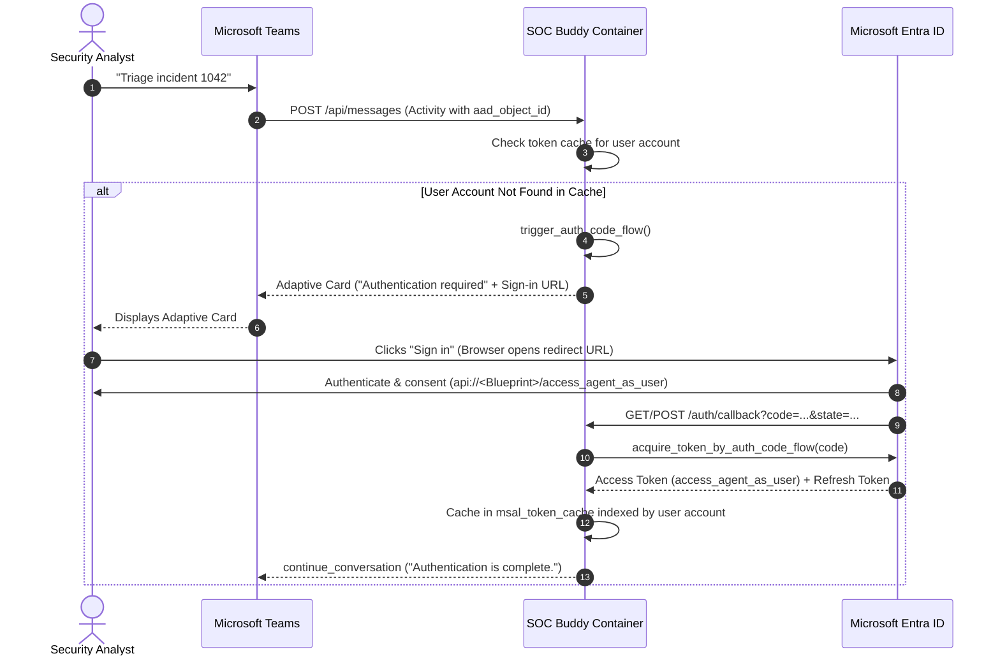
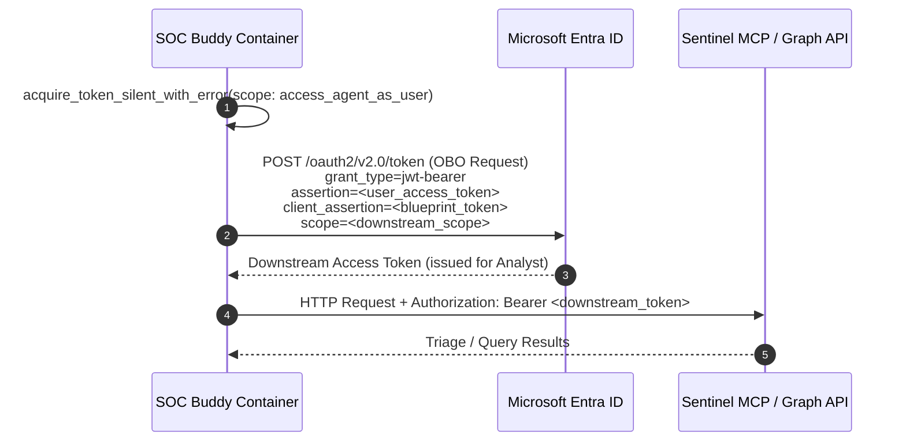
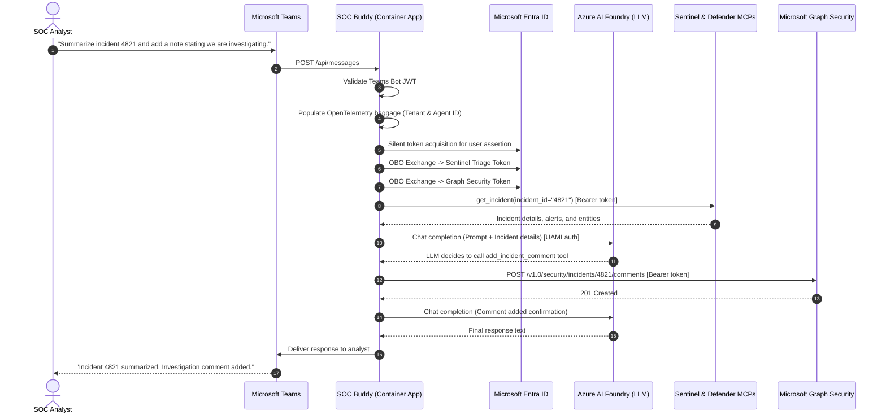

## 1. Identity Architecture & Token Flows

SOC Buddy uses a multi-tiered, zero-shared-secrets identity architecture. All credentials between the container and Entra ID use Federated Identity Credentials (FIC) based on OpenID Connect (OIDC) token exchange.

### 1.1. Identity Models Overview

There are three distinct identities involved in SOC Buddy:

1. User-Assigned Managed Identity (UAMI)
    - Azure resource identity
    - Pulls images from ACR
    - Authenticates to AI Foundry
    - Acts as federated credential for Teams bot and agent blueprint

2. Teams Bot Application (Client App)
    - Integrates with Teams via Agents SDK to receive/send messages
    - Client app for user authorization code flow (first half of OBO flow)
    - Uses UAMI assertion as FIC

3. Agent Blueprint / Identity
    - Represents the agent, acts as agent kill switch 
    - Possesses delegated scopes
    - Performs OBO token exchanges (second half of OBO flow)
    - Uses UAMI assertion as FIC

### 1.2. Teams Bot Identity

#### 1.2.1. Bot Framework Ingress & JWT Validation
Incoming HTTP POST requests to `/api/messages` originate from Microsoft Teams infrastructure. The service validates each request using `jwt_authorization_decorator` and `CloudAdapter`:
1. The incoming request includes an `Authorization: Bearer <token>` header issued by `https://api.botframework.com`.
2. `MsalConnectionManager` maps the incoming service URL:
   - Bot Framework traffic (`https://api.botframework.com` or `https://smba.trafficmanager.net`) routes to `SERVICE_CONNECTION`.
   - General agentic traffic routes to `AGENTIC`.
3. To communicate back with Bot Framework, the service uses `get_teams_bot_msal_app()`:
   - The UAMI requests an OIDC assertion token for `api://AzureADTokenExchange/.default`.
   - MSAL sends this assertion to Entra ID to authenticate as the Teams Bot App registration (`TEAMS_BOT_CLIENT_ID`) via Federated Identity Credentials.
   - No client secret is stored in configuration.

#### 1.2.2. OAuth Authorization Code Flow for Human Assertion
Because security operations affect live incidents and sensitive telemetry, the agent acts strictly on-behalf-of the signed-in analyst.



1. When an analyst sends a message, the bot extracts the user's Entra Object ID (`context.activity.from_property.aad_object_id`).
2. If no valid cached tokens exist for this user, `trigger_auth_code_flow()` generates an authorization URL with:
    - Scope: `api://<BLUEPRINT_CLIENT_ID>/access_agent_as_user`
    - Redirect URI: `https://<APP_NAME>.<CAE_DOMAIN>/auth/callback`
    - Response Mode: `form_post`
3. The bot sends an Adaptive Card containing an `Action.OpenUrl` button titled "Sign in".
4. The user completes authentication in their browser. Entra ID redirects the authorization code to `/auth/callback`.
5. `redeem_auth_code()` exchanges the code for user tokens and stores them in `msal_token_cache`.
6. The bot invokes `adapter.continue_conversation` using the preserved `continuation_activity` to inform the user that authentication succeeded.

### 1.3. Agent Identity

The Agent Identity represents the AI Teammate in Microsoft 365 and Entra ID.

#### 1.3.1. Agent Blueprint & Federated Identity Credentials (FIC)
The Agent Blueprint is created during `a365 setup all`. To allow the Container App to act as the Blueprint without storing certificates or client secrets:
- An FIC named `containerapp-uami-fic` is configured on the Blueprint App registration.
- Issuer: `https://login.microsoftonline.com/<TENANT_ID>/v2.0`
- Subject: `<UAMI_PRINCIPAL_ID>` (Object ID of the Managed Identity)
- Audience: `api://AzureADTokenExchange`

When acquiring a token as the Blueprint, `get_agent_id_msal_app()`:
1. Obtains a token via the `AGENTIC` connection provider.
2. Uses this token as a client assertion to instantiate `msal.ConfidentialClientApplication` representing the agent instance.

#### 1.3.2. Agent 365 Observability via OpenTelemetry
SOC Buddy exports real-time traces and metrics to Microsoft Agent 365:
- Uses `microsoft.opentelemetry` with `use_microsoft_opentelemetry(enable_a365=True)`.
- The `a365_token_resolver` fetches a Service-to-Service (S2S) client credential token:
    ```python
    async def get_observability_token() -> str:
        return (await get_agent_id_msal_app()).acquire_token_for_client(
            scopes=["api://9b975845-388f-4429-889e-eab1ef63949c/.default"]
        )["access_token"]
    ```
- Before executing each turn, the handler constructs OpenTelemetry baggage context containing:
    - `tenant_id`: Entra Tenant ID
    - `agent_id`: Agentic Instance ID
    - Activity context (conversation ID, sender ID, channel, service URL)

##### Teams Bot Baggage Mapping

SOC Buddy receives messages as a Teams bot, not as an agentic user. Its transport identity is the Teams Bot Application, while its Agent 365 telemetry must identify the configured agent blueprint and agent instance. The Teams activity does not supply all of those identities in the fields expected by the observability helper.

The upstream [populate_baggage implementation](https://github.com/microsoft/opentelemetry-distro-python/blob/main/src/microsoft/opentelemetry/a365/hosting/scope_helpers/populate_baggage.py) reads only `TurnContext.activity` and passes caller, target agent, tenant, channel, and conversation pairs to `BaggageBuilder.set_pairs()`. The [scope helper utilities](https://github.com/microsoft/opentelemetry-distro-python/blob/main/src/microsoft/opentelemetry/a365/hosting/scope_helpers/utils.py) define these mappings (all source paths below are relative to `activity`):

| Baggage key | Source used by `populate` |
|---|---|
| `user.id` | `from_property.aad_object_id` |
| `user.name` | `from_property.name` |
| `user.email` | `from_property.agentic_user_id` |
| `gen_ai.agent.id` | `get_agentic_instance_id()`: `recipient.agentic_app_id` for an agentic request |
| `gen_ai.agent.name` | `recipient.name` |
| `microsoft.agent.user.id` | `recipient.aad_object_id` |
| `microsoft.agent.user.email` | `get_agentic_user()`: `recipient.agentic_user_id` for an agentic request |
| `gen_ai.agent.description` | `recipient.role` |
| `microsoft.tenant.id` | `recipient.tenant_id` |
| `microsoft.channel.name` | `channel_id.channel`, or `channel_id` when it is a string |
| `microsoft.channel.link` | `channel_id.sub_channel`, falling back to `channel_data["productContext"]` |
| `gen_ai.conversation.id` | `conversation.id` |
| `microsoft.conversation.item.link` | `service_url` |

There is no agent blueprint mapping. The helper does not inspect adapter configuration, claims, or turn state to recover missing identities, nor does it map the activity ID.

For SOC Buddy's observed Teams messages:
- The tenant ID exists in `conversation.tenant_id` and `channel_data["tenant"]["id"]`, but `recipient.tenant_id` is `None`. The helper has no fallback to either Teams location.
- `recipient.id` identifies the Teams bot with a `28:` prefix. It is not the agent instance ID, and the helper does not use it. The recipient's `role` and `agentic_app_id` are `None`, so `get_agentic_instance_id()` returns `None`.
- The agent blueprint ID is deployment configuration, not a field extracted from the incoming activity.
- The recipient's `aad_object_id` and `agentic_user_id` are `None`, so the agent user ID and email are absent. In contrast, the human analyst's `from_property.aad_object_id` is present and is automatically mapped to `user.id`.

Relying on `populate` alone therefore leaves the tenant, blueprint, agent instance, and agent user identity dimensions out of the baggage supplied for export. This is a baggage extraction gap, not evidence that the exporter drops a populated human `user.id`.

Design decision: construct the baggage explicitly from deployment configuration and the authenticated turn's sender before calling `populate` for the remaining activity metadata. The current handler in [app/app.py](app/app.py) supplies:

| Builder method | Explicit source | Baggage key |
|---|---|---|
| `.tenant_id(tenant_id)` | `SERVICE_CONNECTION` tenant configuration | `microsoft.tenant.id` |
| `.agent_blueprint_id(...)` | `AGENTIC` connection client ID | `microsoft.a365.agent.blueprint.id` |
| `.agent_id(agent_id)` | `AGENTIC_INSTANCE_ID` | `gen_ai.agent.id` |
| `.agentic_user_id(user_id)` | `activity.from_property.aad_object_id` | `microsoft.agent.user.id` |

The last mapping is an application-specific attribution choice in the current implementation: it places the human analyst's object ID in an agent-user field. It does not establish an actual agentic user identity and must not be interpreted as one; the semantically correct human identity remains `user.id`. If a distinct agentic user is provisioned, its object ID belongs in `microsoft.agent.user.id` instead.

`BaggageBuilder` ignores `None` and blank values, so `populate` preserves these manual values for the observed Teams activity. Nonempty extracted values can overwrite earlier assignments; manual values that must always take precedence should be applied after `populate`. The handler's `with builder.build():` scope makes the resulting baggage available during the turn.

#### 1.3.3. On-Behalf-Of (OBO) Delegation with User Assertion
To call downstream APIs, SOC Buddy uses the OAuth 2.0 On-Behalf-Of (OBO) flow (`urn:ietf:params:oauth:grant-type:jwt-bearer`):



1. `get_obo_token(user_id, scopes)` locates the analyst's account in `msal_token_cache`.
2. It executes `acquire_token_silent_with_error([agentbp_scope], account=account)` to get a valid user access token for `api://<BLUEPRINT_CLIENT_ID>/access_agent_as_user`.
3. It passes this token as the `user_assertion` into `acquire_token_on_behalf_of(user_assertion=..., scopes=scopes)`.
4. Entra ID validates the user assertion, checks that admin consent exists for the requested scopes, and issues an access token for the downstream resource.
5. All downstream actions are strictly audited and evaluated against the analyst's own Entra permissions and Conditional Access policies.

### 1.4. End-to-End Sequence Diagram



## 2. Tool Catalog & Delegated Permissions

### 2.1. Permission Summary Matrix

| Resource API | Application ID | Object ID | Scope Name | Type | Purpose |
|---|---|---|---|---|---|
| Sentinel Platform Services<br>(Sentinel MCP Data Exploration) | `4500ebfb-89b6-4b14-a480-7f749797bfcd` | `eaff9684-612c-4add-aa10-035fd3bfe3d1` | `SentinelPlatform.DelegatedAccess` | Delegated (OBO) | Execute KQL hunting queries, discover workspace tables, read log telemetry. |
| Microsoft Defender Mcp<br>(Sentinel MCP Triage) | `7b7b3966-1961-47b5-b080-43ca5482e21c` | `8dd500d0-c3aa-4380-96d1-09b4b6233eff` | `MCP.Read.All` | Delegated (OBO) | Inspect Defender XDR incidents, alert evidence, impacted devices, and identities. |
| Work IQ Mail MCP | `16b1878d-62c7-4009-aa25-68989d63bbad` | `93aac09f-5f9b-4b4c-aa45-c623a1b69342` | `Tools.ListInvoke.All` | Delegated (OBO) | Read analyst email notifications, search incident email threads, draft communications. |
| Microsoft Graph | `00000003-0000-0000-c000-000000000000` | `aaad2076-26ab-4905-b1eb-090f627b17d7` | `SecurityIncident.ReadWrite.All` | Delegated (OBO) | Post comments to incidents and update status, classification, determination, and tags. |
| Agent365Observability | `9b975845-388f-4429-889e-eab1ef63949c` | `a3af7c4d-8203-45c5-a467-ea084e2bbcfa` | `Agent365.Observability.OtelWrite` | Application (S2S) | Export agent spans, traces, and metrics to Microsoft Agent 365 control plane. |

### 2.2. Sentinel MCP Data Exploration Tools

- Base URL: `https://sentinel.microsoft.com/mcp/data-exploration`
- Authentication: Bearer token with scope `4500ebfb-89b6-4b14-a480-7f749797bfcd/SentinelPlatform.DelegatedAccess`
- Transport: Streamable HTTP (`langchain_mcp_adapters.client.MultiServerMCPClient`)

| Tool Name | Description | Key Parameters |
|---|---|---|
| `runKqlQuery` | Executes read-only KQL queries across Log Analytics workspaces connected to Sentinel. | `workspaceId`, `query`, `timespan` |
| `listTables` | Enumerates available security and operational tables (e.g., `DeviceProcessEvents`, `SigninLogs`, `SecurityEvent`). | `workspaceId` |
| `getTableSchema` | Retrieves schema definitions and column types for a specific log table. | `workspaceId`, `tableName` |
| `listWorkspaces` | Discovers Sentinel workspaces accessible to the authenticated analyst. | None |

### 2.3. Sentinel MCP Defender Triage Tools

- Base URL: `https://sentinel.microsoft.com/mcp/triage`
- Authentication: Bearer token with scope `7b7b3966-1961-47b5-b080-43ca5482e21c/MCP.Read.All`
- Transport: Streamable HTTP

| Tool Name | Description | Key Parameters |
|---|---|---|
| `getIncident` | Fetches comprehensive details for a specific Defender XDR / Sentinel incident. | `incidentId` |
| `listAlertsForIncident` | Lists alerts associated with an incident, including severity, MITRE tactics, and detector sources. | `incidentId` |
| `getAlertEvidence` | Retrieves entities and evidence (files, IPs, URLs, processes, registry keys) linked to an alert. | `alertId` |
| `getEntityDetails` | Obtains enriched identity or device details (Entra account risk, device health, Defender status). | `entityId`, `entityType` |

### 2.4. Work IQ Mail MCP Tools

- Base URL: `https://agent365.svc.cloud.microsoft/agents/servers/mcp_MailTools`
- Authentication: Bearer token with scope `16b1878d-62c7-4009-aa25-68989d63bbad/Tools.ListInvoke.All`
- Transport: Streamable HTTP

| Tool Name | Description | Key Parameters |
|---|---|---|
| `searchEmails` | Searches mailbox messages matching queries (e.g., automated alert emails, user escalation threads). | `query`, `folder`, `maxResults` |
| `readEmail` | Reads the body and headers of a specific email message. | `messageId` |
| `draftEmail` | Prepares an email draft for the analyst to review before sending incident updates to stakeholders. | `to`, `subject`, `body` |

### 2.5. Microsoft Graph Security Incident Tools

Implemented natively in Python using the `msgraph-sdk` and `GraphServiceClient`.
- Target URL: `https://graph.microsoft.com/v1.0/security/incidents`
- Authentication: Bearer token with scope `https://graph.microsoft.com/.default` (negotiated with `SecurityIncident.ReadWrite.All`)

#### 2.5.1. `add_incident_comment`
- Description: Appends an analytical comment or investigation note to a security incident.
- Parameters:
    | Parameter | Type | Description |
    |---|---|---|
    | `incident_id` | `str` | Target Microsoft Defender / Sentinel incident ID. |
    | `comment` | `str` | Body text of the comment to record. |
- REST Equivalent: `POST https://graph.microsoft.com/v1.0/security/incidents/{incident_id}/comments`

#### 2.5.2. `update_incident`
- Description: Updates incident lifecycle state, owner assignment, classification, determination, and tags.
- Parameters:
    | Parameter | Type | Description |
    |---|---|---|
    | `incident_id` | `str` | Target incident ID.
    | `status` | `Optional[str]` | `active`, `inProgress`, `resolved`, or `redirected`. |
    | `assigned_to` | `Optional[str]` | User principal name or group to assign. |
    | `classification` | `Optional[str]` | `falsePositive`, `truePositive`, or `informationalExpectedActivity`. |
    | `determination` | `Optional[str]` | `unknown`, `apt`, `malware`, `securityPersonnel`, `securityTesting`, `unwantedSoftware`, `multiStagedAttack`, `compromisedAccount`, `phishing`, `maliciousUserActivity`, `notMalicious`, `notEnoughDataToValidate`, `confirmedUserActivity`, `lineOfBusinessApplication`. |
    | `custom_tags` | `Optional[list[str]]` | Custom metadata labels applied to the incident. |
    | `resolving_comment` | `Optional[str]` | Explanation of why the incident was closed or classified. |
- REST Equivalent: `PATCH https://graph.microsoft.com/v1.0/security/incidents/{incident_id}`

### 2.6. Built-In Utility Tools

- `current_utc_time`: Returns the current UTC timestamp in ISO 8601 format to give the model accurate temporal context when filtering alerts or calculating time windows.
- `WebSearchTool`: Built-in Azure AI web search tool enabling the model to search external intelligence feeds, CVE details, and vendor threat advisories.
