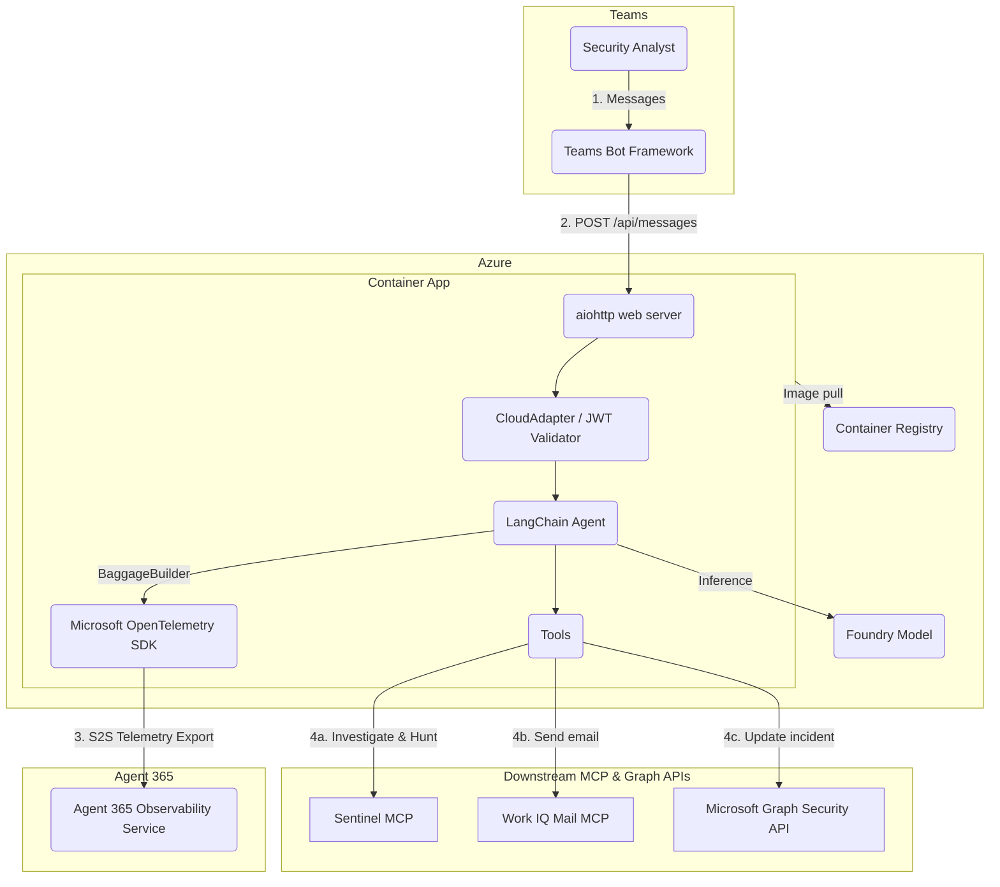
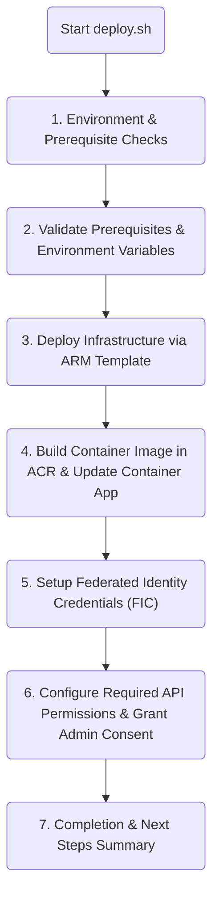

# SOC Buddy

SOC Buddy is a security operations companion for security teams using Microsoft Sentinel and Defender XDR.

It helps analysts triage/manage incidents, execute KQL threat hunts, inspect evidences, and draft communications directly within Microsoft Teams.

It is built on LangChain with Agent 365 observability integration, and uses on-behalf-of user access with the following tools:
- [Sentinel MCP](https://learn.microsoft.com/en-us/azure/sentinel/datalake/sentinel-mcp-overview)
  - [Data exploration](https://learn.microsoft.com/en-us/azure/sentinel/datalake/sentinel-mcp-data-exploration-tool)
  - [Triage](https://learn.microsoft.com/en-us/azure/sentinel/datalake/sentinel-mcp-triage-tool)
- [Microsoft Graph Security API](https://learn.microsoft.com/en-us/graph/api/resources/security-api-overview)
  - [Create comment](https://learn.microsoft.com/en-us/graph/api/security-incident-post-comments)
  - [Update incident](https://learn.microsoft.com/en-us/graph/api/security-incident-update)
- [Work IQ Mail](https://learn.microsoft.com/en-us/microsoft-copilot-studio/mcp-mail-tools)
- Foundry [web search tool](https://learn.microsoft.com/en-us/azure/foundry/agents/how-to/tools/web-search)

Jump straight to [⬇️ setup ⬇️](#setup)

## 0. Architecture Overview

> [!Tip]
>
> Details on identity architecture and tools catalog are in [DESIGN.md](DESIGN.md)

### 0.1. Component Topology

SOC Buddy operates as a containerized Python service deployed in Azure Container Apps powered by LLM from Foundry.



### 0.2. Component Descriptions & Interactions

| Component | Description |
|---|---|
| Microsoft Teams Client | The interactive interface for security analysts to query incidents, request KQL hunting queries, draft investigation summaries. Authorizations are sent in Teams via Adaptive Cards. |
| Teams Bot Framework | Routes messages between Microsoft Teams and the containerized endpoint (`/api/messages`). Uses HMAC and JWT tokens signed by Microsoft Bot Framework roots to authenticate payloads. |
| Azure Container App (SOC Buddy Service) | - Runs image from Container Registry.<br>- Expose `aiohttp` running the Microsoft Agents SDK and LangChain.<br>- Integrates `MultiServerMCPClient` to connect dynamically to remote Model Context Protocol (MCP) endpoints. |
| Microsoft Foundry | Provides foundational LLM capabilities (e.g., `gpt-5.6-luna`). The Container App authenticates directly to Foundry using Azure User-Assigned Managed Identity (UAMI), requiring no API keys. |
| Remote MCP Servers | Standardized tool providers running over Streamable HTTP transports. Each MCP server requires bearer token authentication issued by Microsoft Entra ID. |
| Microsoft Graph Security API | Native REST interface for reading, commenting on, assigning, and closing security incidents across Microsoft Defender XDR and Sentinel. |

### 0.3. Repository Structure

```sh
soc-buddy/
├── deploy.sh            # Deployment script to run in Azure Cloud Shell
├── DESIGN.md            # Details on identity architecture and tools catalog
├── SETUP.md             # Setup guide and prerequisites
├── containerapp.yaml    # Azure Container Apps template definition
├── Dockerfile           # Container image build to run the SOC Buddy application
├── pyproject.toml       # Python dependencies required by the SOC Buddy application
└── app/
    └── app.py           # SOC Buddy application
```

# Setup

The setup is designed to be run in Azure Cloud Shell (bash), which has `az`, `dotnet`, `python`, and `pwsh` available.

> [!Important]
>
> Azure Cloud Shell is convenient, but the session is ephemeral, so any files to be kept from the session must be download via `Manage files`.

## 1. Prerequisites

### 1.1. Required Roles and Permissions

Deploying SOC Buddy interacts with Azure Subscription resources and Microsoft Entra ID. Ensure the deploying user (or automated service principal) possesses the following roles:

| Least privilege role | Type / Scope | Usage |
|---|---|---|
| Contributor | Azure RBAC / Subscription | Create Azure resources. |
| User Access Administrator | Azure RBAC / Subscription | Assign `Cognitive Services User` and `AcrPull` roles to the User-Assigned Managed Identity (UAMI). |
| Cloud Application Administrator / Application Administrator | Entra ID / User | Create service principal; Add Federated Identity Credentials (FIC) to the Agent Blueprint and Teams Bot app registrations. |
| Privileged Role Administrator | Entra ID / User | Grant tenant-wide Admin Consent for delegated scopes on the Blueprint (`SecurityIncident.ReadWrite.All`, Sentinel MCP scopes). |
| AI Administrator | Entra ID / User | Publish agent manifest in Microsoft 365 Admin Center. |

### 1.2. Provision Agent Identity  with a365 CLI

The a365 CLI requires several human interaction when provisioning agent identity. Hence, this is done before running `deploy.sh`.

1. Install a365 CLI in the Cloud Shell:

    ```sh
    dotnet tool install --global Microsoft.Agents.A365.DevTools.Cli
    export PATH=$PATH:/home/system/.dotnet/tools/
    ```

2. Verify Client App Requirements:

    ```sh
    a365 setup requirements
    ```

3. Add Work IQ Mail MCP server

    ```sh
    a365 develop add-mcp-servers mcp_MailTools
    ```

4. Provision the Agent:

    Enter `y` when prompted to assign `Agent365.Observability.OtelWrite` application permission

    ```sh
    a365 setup all -n <your-agent-name>
    ```

> Optional: delete agent blueprint client secret
>
> ```sh
> BLUEPRINT_CLIENT_ID=$(python3 -c "import json; print(json.load(open('a365.generated.config.json'))['agentBlueprintId'])")
> BLUEPRINT_SECRET_ID=$(az ad app credential list --id $BLUEPRINT_CLIENT_ID --query "[].{KeyId:keyId}" -o tsv)
> az ad app credential delete --id $BLUEPRINT_CLIENT_ID --key-id $BLUEPRINT_SECRET_ID
> ```

5. Capture Generated Files:

> [!Important]
>
> Download the `a365.config.json` and `a365.generated.config.json` files from the cloud shell via `Manage files` and keep them.
>
> `a365.generated.config.json` contains the following information that is used by `deploy.sh`:
> - `agentBlueprintId`: The Client ID of the blueprint app registration.
> - `agentIdentityId`: The object/instance ID of the agent identity service principal.
> - `tenantId`: Entra Tenant ID.

### 1.3. Create the Teams Bot App Registration

SOC Buddy communicates with human analysts in Microsoft Teams via a Teams Bot application.

1. Go to [Teams Developer Portal → Bot management](https://dev.teams.microsoft.com/tools/bots)
2. Select `New bot`
3. Give a name and click `Create bot`
4. Copy the Bot Id (Client ID)

## 2. Running the Deployment Script

### 2.1. How to Run in Azure Cloud Shell

1. Launch [Azure Cloud Shell](https://shell.azure.com) in Bash mode.
2. Clone or copy the project repository into Cloud Shell:
    ```sh
    git clone https://github.com/joetanx/soc-buddy
    cd soc-buddy
    ```
3. Ensure `a365.generated.config.json` is present in the working directory (upload via `Manage files`).
4. Export the required environment variables:
    ```sh
    export TEAMS_BOT_CLIENT_ID="<your-teams-bot-client-id>"
    export APP_NAME="<your-app-name>"
    export LOCATION="<azure-region>"       # e.g., "southeastasia"
    export FOUNDRY_MODEL="gpt-5.6-luna"    # Optional: defaults to gpt-5.6-luna if omitted
    ```
5. Set the Azure subscription to be deployed in
    ```sh
    az account set -s <subscription-id>
    ```
6. Make `deploy.sh` executable and run it:
    ```sh
    chmod +x deploy.sh
    ./deploy.sh
    ```

### 2.2. What the Script Does (Step-by-Step Breakdown)

The deployment script automates all required Azure infrastructure setup using an ARM template ([azuredeploy.json](azuredeploy.json)):



1. Environment & Prerequisite Checks
    - Verify `az`, `pwsh`, and `python3` are available
    - Ensure resource providers `Microsoft.App`, `Microsoft.OperationalInsights`, `Microsoft.ContainerRegistry`, and `Microsoft.CognitiveServices` are registered
    - Ensure Sentinel Triage MCP Service Principal exists
2. Validate Prerequisites & Environment Variables
    - Check that `a365.generated.config.json` and `azuredeploy.json` files exist
    - Check required environment variables (`TEAMS_BOT_CLIENT_ID`, `APP_NAME`, `LOCATION`), and default `FOUNDRY_MODEL` to `gpt-5.6-luna`
    - Parse `a365.generated.config.json` for agent blueprint, agent identity and tenant IDs
    - Ensure resource group (`rg-${APP_NAME}`) exists
    - Resolve model version for specified model
3. Deploy Infrastructure via ARM Template
   - Deploys `azuredeploy.json` using `az deployment group create`.
   - Provisions:
     - User-Assigned Managed Identity (UAMI)
     - Azure Container Registry (ACR, Basic SKU)
     - Log Analytics Workspace & Azure Container Apps Environment (CAE)
     - Azure AI Foundry (`AIServices` S0 + Model Deployment with resolved model version)
     - RBAC Role Assignments: `Cognitive Services User` and `AcrPull` for UAMI
     - Azure Container App (with initial image and all environment variables / connections)
   - Outputs: `acrName`, `uamiPrincipalId`, `uamiClientId`, `messagingEndpoint`, `oauthRedirectUri`, `foundryEndpoint`
4. Build Container Image in ACR & Update Container App
    - Submits workspace directory (`Dockerfile`, `pyproject.toml`, `app.py`) to Container Registry for cloud build (`az acr build`)
    - Updates Container App from initial image to built image (`${ACR_NAME}.azurecr.io/${APP_NAME}:latest`).
5. Setup Federated Identity Credentials (FIC)
    - Add UAMI as FIC to agent blueprint and Teams bot app
    - Configure redirect URI and agent blueprint API permission on Teams bot app
6. Configure Required API Permissions & Grant Admin Consent
    - Add the Sentinel Data Exploration and Triage MCP resources to the agent blueprint's inheritable permissions
    - Assign MCP and API permissions to agent blueprint
    - Grant admin consent for assigned permissions
    - Verify permissions granted
7. Completion & Next Steps Summary
    - Displays final `MESSAGING_ENDPOINT`, `OAUTH_REDIRECT_URI`, `ACR_NAME`, and post-deployment checklist.

## 3. Post-Deployment Configuration

Note the messaging endpoint output from script completion: `https://<APP_NAME>.<CAE_DOMAIN>/api/messages`

### 3.1. Configure Azure Bot Service Messaging Endpoint
1. Go to [Teams Developer Portal - Bot management](https://dev.teams.microsoft.com/tools/bots)
2. Click on the Teams bot created earlier
3. In `Endpoint address`, enter: `https://<APP_NAME>.<CAE_DOMAIN>/api/messages`
4. Save changes

### 3.2. Publish & Activate Agent in Microsoft 365 Admin Center
1. Download the [example Teams app manifest](https://github.com/joetanx/defender/tree/main/soc-buddy/manifest/manifest.json)
2. Replace `<teams-bot-id>` and `<agent-identity>` placeholders with the respectic IDs
3. Download the generic [color.png](https://github.com/joetanx/defender/tree/main/soc-buddy/manifest/color.png) and [outline.png](https://github.com/joetanx/defender/tree/main/soc-buddy/manifest/outline.png) icons or use your own icons ([icons must meet certain size requirements](https://learn.microsoft.com/en-us/microsoftteams/platform/concepts/design/design-teams-app-icon-store-appbar))
4. Zip `manifest.json`, `color.png` and `outline.png` into a zip package
5. Open [Microsoft 365 Admin Center - Agents](https://admin.cloud.microsoft/#/agents/all)
6. Click `Add agent` → `Choose file` → select the zipped package → click `Next`
7. Select the users or security groups authorized to interact with SOC Buddy → click `Next`
8. Apply desired policy template → click `Next`
9. Review the permission → click `Publish`
